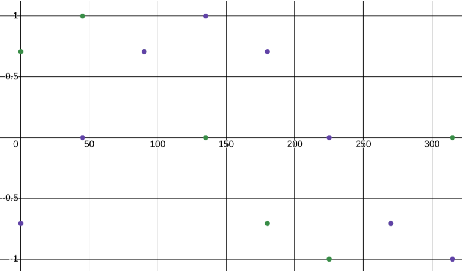

*Requisite math knowledge: vectors, trigonometry, basic waveforms, function transformations*

# Mecanum Wheels and Movement

Mecanum wheels are specially designed wheels that allow us to move omnidirectionally, or in all direct
ions, without the need for a steering system by apparently exerting a diagonal force.

The following diagram illustrates one potential arrangement of four mecanum wheels on a robot that wil
l be used as the basis for the rest of these notes:


Looking at the simplified diagram, force A is angled at 45 degrees, and force B is angled at -45 degre
es. This means that their individual components are equal to each other in magnitude (remember $`\sin(4
5)=\frac{\sqrt{2}}{2}`$ and $`\cos(45)=\frac{\sqrt{2}}{2}`$ so $`\sin(45)=\cos(45)`$). This will come up in a
 moment.

Anyways, how do we program the wheels and their motor inputs for omnidirectional movement?


Let’s approach this from a mathematical, physical perspective first. (This is a useful approach in pro
gramming!)

The first constraint is that for a given power P we do not want the total magnitude of A and B to exce
ed P, rather we want them to equal P. In more mathematical terms:

$`||\vec{A}||+||\vec{B}||=P`$, ($`||\vec{x}||`$ means to take the *magnitude* of $`x`$)

$`\sqrt{(A_x)^2+(A_y)^2}+\sqrt{(B_x)^2+(B_y)^2}=P`$

$`A^2+B^2=P`$

$`|A_x|=|A_y|`$ and $`|B_x|=|B_y|`$

The second constraint is that for a given angle $`\theta`$ we want $`\tan(\theta)=\frac{A}{B}`$. Using these two constraints (and some algebra), we may create the following table (shown on the next page):

*All angles in these notes are in degrees*

| power (0 to 1) | angle (degrees) | A  power                | B power                 |
|----------------|-----------------|-------------------------|-------------------------|
| 1              | 0               | $`\frac{\sqrt{2}}{2}`$  | $`-\frac{\sqrt{2}}{2}`$ |
| 1              | 45              | 1                       | 0                       |
| 1              | 90              | $`\frac{\sqrt{2}}{2}`$  | $`\frac{\sqrt{2}}{2}`$  |
| 1              | 135             | 0                       | 1                       |
| 1              | 180             | $`-\frac{\sqrt{2}}{2}`$ | $`\frac{\sqrt{2}}{2}`$  |
| 1              | 225             | -1                      | 0                       |
| 1              | 270             | $`-\frac{\sqrt{2}}{2}`$ | $`-\frac{\sqrt{2}}{2}`$ |
| 1              | 315             | 0                       | -1                      |

Plotting these points $`(\theta, A) and (\theta, B)`$ yields the following plot:



It is apparent that these points follow a *sinusoidal pattern*.

Letting $`A(\theta)=\sin(\theta+45)`$ and $`B(\theta)=\sin(\theta-45)`$ where  represents the desired angle of travel, we get the following graph:


These functions are a perfect fit for our points, even for points that we haven’t calculated! Unfortunately, we still have to account for desired power. (For obvious reasons, we may not want to be moving at full power all the time.) This, however, is an easy fix:
$`A(\theta)=P\sin(\theta+45)`$
$`B(\theta)=P\sin(\theta-45)`$
where $`P`$ is the desired power.

This should be suitable for use in getting our robot to move where we want it to.

Now we have to translate these mathematical findings into our code. This shouldn’t be too hard to figure out yourself, but here’s a pseudo code example (on the next page):

``` Java
double mag = sqrt((stickY^2) + (stickX^2));
double driveAngle = arctan(stickY, stickX);
double powerA = sin(driveAngle + PI/4);
double powerB = sin(driveAngle - PI/4);
frontRightMotor.setPower(mag * powerB);
frontLeftMotor.setPower(mag * powerA);
backLeftMotor.setPower(mag * powerB);
backRightMotor.setPower(mag * powerA);
```

*N.B. Always assume that all mathematical functions in programming languages use radians unless otherwise specified. All pseudo code blocks in these notes will use radians. If you really want to use degrees, do the conversions yourself, but it’s much easier to use it as it is with radians.*


Implementing rotation shouldn’t be too difficult to implement either. The motors on the right side of the robot merely need to be going in the opposite direction of the motors on the left side, so: 

```Java
double mag = sqrt((lStickY^2) + (lStickX^2));
double driveAngle = arctan(lStickY, lStickX);
double powerA = sin(driveAngle + PI/4);
double powerB = sin(driveAngle - PI/4);
frontRightMotor.setPower(mag * powerB + rStickX);
frontLeftMotor.setPower(mag * powerA - rStickX);
backLeftMotor.setPower(mag * powerB - rStickX);
backRightMotor.setPower(mag * powerA + rStickX);
```

(You can visualize the forces yourself; refer to the diagram at the start of these notes.)

# Mecanum Wheel Movement Optimization

Recall that the range of possible values for `DcMotor.setPower` is \[-1, 1]. Let’s say that we want to move as fast as possible, and so logically that precipitates letting our power $`P=1`$. In this example, also let angle $`\theta=90`$. Substitute these parameters into our previously found functions:

$`A(90, 1)=(1)sin((90)+45)=\sin(45)=\frac{\sqrt{2}}{2}`$  
$`B(90, 1)=(1)sin((90)-45)=\sin(135)=\frac{\sqrt{2}}{2}`$

It turns out that we are inputting $`\frac{\sqrt{2}}{2}`$ into `DcMotor.setPower`, which is admittedly a ways off from the maximum input value of 1. If this value of $`P`$, 1, is supposed to represent the maximum possible power (which is likely the intent), then clearly our motors are not running at the maximum possible power. We need some sort of scaling factor to get this full power all while preserving our desired direction.

Once again creating a table and letting the power $`P=1`$:

| Angle | A                       | B                       | **Scaling**            | New A | New B                   |
|-------|-------------------------|-------------------------|------------------------|-------|-------------------------|
| 0     | $`\frac{\sqrt{2}}{2}`$  | $`-\frac{\sqrt{2}}{2}`$ | $`\sqrt{2}`$           | 1     | -1                      |
| 15    | $`\frac{\sqrt{3}}{2}`$  | $`-\frac{1}{2}`$        | $`\frac{2}{\sqrt{3}}`$ | 1     | $`-\frac{\sqrt{3}}{3}`$ |
| 30    | 0.965926                | -0.258819               | $`\frac{1}{0.965926)`$ | 1     | -0.673227               |
| 45    | 1                       | 0                       | 1                      | 1     | 0                       |
| 60    | 0.965926                | 0.258819                | $`\frac{1}{0.965926)`$ | 1     | 0.673227                |
| 75    | $`\frac{\sqrt{3}}{2}`$  | $`\frac{1}{2}`$         | $`\frac{2}{\sqrt{3}}`$ | 1     | $`\frac{\sqrt{3}}{3}`$  |
| 90    | $`\frac{1}{\sqrt{2}}`$  | $`\frac{1}{\sqrt{2}}`$  | $`\sqrt{2}`$           | 1     | 1                       |
| 135   | 0                       | 1                       | 1                      | 0     | 1                       |
| 180   | $`-\frac{\sqrt{2}}{2}`$ | $`\frac{\sqrt{2}}{2}`$  | $`\sqrt{2}`$           | -1    | 1                       |

Plotted:
.

Note that the scaling column in the previous table may expressed as:

$`\frac{1}{max(A(\theta),B(\theta))}=max(\csc(\theta+45),\csc(\theta-45))`$.

Putting a cosecant function into the graph and translating it into place:


*Function pictured:* $`\csc(\theta+45)`$

This cosecant function is obviously a perfect fit — for the first part of the wave, at least. Hence, we will need to find a way to repeat that section of the cosecant curve. We can do this by composing this cosecant function with either a triangular wave or a sawtooth wave. In this case, we’ll use a sawtooth wave as it is the comparatively simpler waveform.

A sawtooth wave is defined as:

$`W_{saw}(x)=-floor(x+\frac{1}{2})`$

The period of our wave that we need to find is 90, we want the wave to start at 0, and the range that we need for our cosecant function is \[0, 90]. Transforming sawtooth wave such that these criteria are met, we get:

$`W_{saw mod}(x)=90*(\frac{1}{90}(x-45)-floor(\frac{1}{90}(x-45)+\frac{1}{2}))+90`$

Then we simply substitute this for x in our cosecant function to get our scaling factor:

$`S(\theta)=\csc(W_{saw mod}(\theta)+45)`$

Graphed:


$`A_{new}(\theta)=S(\theta)A(\theta,P)`$

$`B_{new}(\theta)=S(\theta)B(\theta,P)`$

This scaling factor automatically clamps the functions; that is, the range of A and B is conveniently restricted to \[-1, 1]. The old functions are shown with broken lines.

Again, putting this into code shouldn’t be too difficult, aside from clarity. Nevertheless, here’s another pseudo code example:

```Java
double mag = sqrt((stickY^2) + (stickX^2));
double driveAngle = arctan(stickY, stickX);
double scaling = sec((PI/2)
double sawIn = (2 / PI) * (driveAngle - PI/4);
double sawOut = ((sawIn) - Math.floor(sawIn + 0.5));
double scaling = sec((PI / 2.0) * sawOut);
double powerA = sin(driveAngle + PI/4);
double powerB = sin(driveAngle - PI/4);
frontRightMotor.setPower(mag * scaling * powerB + rStickX);
frontLeftMotor.setPower(mag * scaling * powerA - rStickX);
backLeftMotor.setPower(mag * scaling * powerB - rStickX);
backRightMotor.setPower(mag * scaling * powerA + rStickX);
```

*N.B. Reciprocal trigonometric functions are not always in the standard math libraries. Recall their definitions!*

**Desmos graph used for these notes: https://www.desmos.com/calculator/we9kt1xclf**
